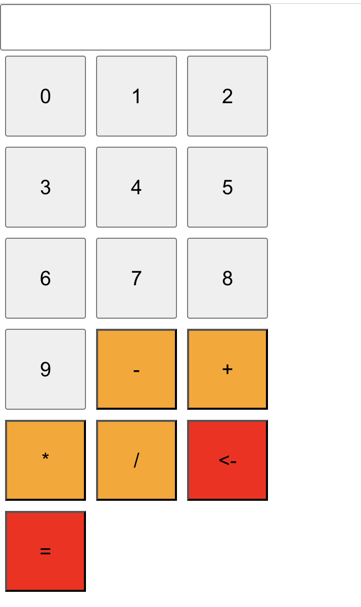

# reactcalculator_typescript

This is a calculator app using React and TypeScript. It performs basic operations.



**Page**: [https://prateekpur.github.io/reactcalculator_typescript/](https://prateekpur.github.io/reactcalculator_typescript/)

### Operations Supported

- Addition, subtraction, multiplication, and division operations.

### Getting Started

To get a local copy up and running, follow these steps:

1. Clone this repository.
2. Navigate to the project directory:
   ```bash
   cd reactcalculator_typescript
   ```
3. Install dependencies: npm install
4. Start the development server: npm start

### Usage

1. Click the buttons to input numbers and operators.
2. Click "=" to get the result of the calculation.
